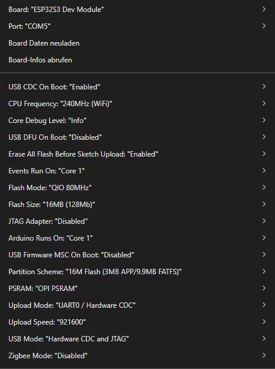

# ES3C28P-ESP32-S3

`Manual`
`Schematic`
`Instructions`

`\* \* Produktparameter:`

\*Touchscreen:ES3C28P  Capazitiv

\*Stromanschluss:USB(TypC)

\*Modul:ESP32-S3

\*CPU:XtensaLX732-BitDual-Core-Prozessor

\*Frequenz:240MHz(max.)

\*Speicher:384KBROM +512KBSRAM +16KBRTCSRAM +16MBexternerQSPI-Flash +8MB PSRAM

\*WLAN:2,4-GHz-Band,unterstützt 20MHz und 40MHz Bandbreite

\*Bluetooth:BluetoothV4.2BR/EDRundBluetoothLEBluetooth:BluetoothV4.2BR/EDRundBluetoothLE

\*Betriebsspannung:3,0–3,6V

`\*LCD-Bildschirmspezifikationen:`

\*Bildschirmgröße:2,8Zoll

\*Bildschirmtyp:TFT

\*Auflösung:240x320Pixel

\*Effektive Anzeigefläche:43,20(B)x57,60(H)mm

\*Farbanzahl:Maximal:262K(RGB666); Üblich:65K(RGB565)Farbanzahl: Maximal:262K(RGB666);

\*Treiber-IC:ILI9341V

\*Display-Schnittstelle:4-LeitungSPI(an ESP32 angeschlossen)

